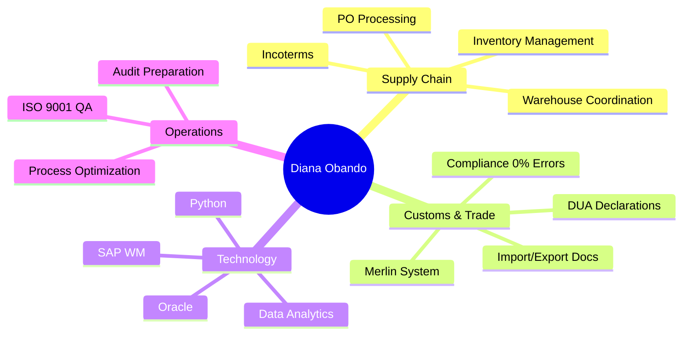

<div align="center">

<!-- Animated Header -->


<!-- Typing Animation -->


<br/>

<!-- Badges -->
<p>
  
  
  
  
</p>

<!-- Social Links with Icons -->
<p>
  <a href="https://www.linkedin.com/in/diana-obando-marchena">
    
  </a>
  <a href="mailto:obando.diana@web.de">
    
  </a>
  <a href="https://github.com/obandodiana-dotc">
    
  </a>
</p>

</div>

<br/>

---

## 🌐 Multilingual Profile | Mehrsprachiges Profil

<details open>
<summary><b>🇬🇧 English Version</b></summary>

<br/>

### 👋 About Me

> **Supply Chain Coordinator** with 5+ years of proven expertise in **customs compliance**, **import/export operations**, and **end-to-end logistics**. Specialized in **process optimization** and ensuring **zero-error workflows** in critical operations.

#### 🎯 Core Expertise



### 💼 Professional Journey

<table>
<tr>
  <td width="30%">
    
  </td>
  <td width="70%">
    <b>Business Operations Specialist</b><br/>
    ✅ 10% CSAT increase<br/>
    ✅ 25% workflow time reduction<br/>
    ✅ 0% error rate in critical processes
  </td>
</tr>
<tr>
  <td>
    
  </td>
  <td>
    <b>Key Account Operations Specialist (Export)</b><br/>
    📦 40+ POs weekly for 5 key accounts<br/>
    🚚 >98% on-time delivery<br/>
    📄 ~70 shipments/month documentation
  </td>
</tr>
<tr>
  <td>
    
  </td>
  <td>
    <b>Warehouse & Inventory Control Assistant</b><br/>
    📊 Monthly audits<br/>
    ✅ 300+ goods movements/day (ISO 9001)<br/>
    📦 1,500+ SKUs managed via WMS
  </td>
</tr>
<tr>
  <td>
    
  </td>
  <td>
    <b>Import Logistics & Customs Intern</b><br/>
    🛃 192 import operations for 36 B2B clients<br/>
    💻 Merlin customs system + DUA declarations<br/>
    🤝 Coordination with customs authorities
  </td>
</tr>
</table>

### 📊 Impact Metrics

<div align="center">

| Metric | Achievement | Impact |
|--------|-------------|---------|
| 🛡️ **Compliance Accuracy** | 0% Errors | Zero compliance violations |
| ⚡ **Process Speed** | 25% Faster | Workflow optimization |
| 📦 **Operations Handled** | 192 Imports | B2B customs clearance |
| 🚚 **Delivery Performance** | 98% On-Time | Client satisfaction |
| 📊 **Inventory Accuracy** | 10% Improvement | WMS optimization |

</div>

</details>

<details>
<summary><b>🇩🇪 Deutsche Version</b></summary>

<br/>

### 👋 Über mich

> **Supply Chain Koordinatorin** mit über 5 Jahren nachgewiesener Expertise in **Zoll-Compliance**, **Import-/Export-Abwicklung** und **End-to-End-Logistik**. Spezialisiert auf **Prozessoptimierung** und Sicherstellung von **fehlerfreien Workflows** bei kritischen Abläufen.

#### 🎯 Kernkompetenzen

- **Supply Chain & Logistik**: Bestandsmanagement, PO-Abwicklung, Lagerkoordination, Incoterms
- **Zoll & Außenhandel**: Zoll-Compliance, DUA-Anmeldungen, Import/Export-Dokumentation
- **ERP & IT-Systeme**: SAP WM, Oracle, WMS, MS Excel, SharePoint, Azure DevOps
- **Digitalisierung**: Python, HTML/CSS, Datenanalyse, KI-Grundlagen

### 💼 Berufserfahrung Highlights

**Banco Popular** (2021-2025)  
🎯 10% CSAT-Steigerung | ⚡ 25% Zeitreduktion | ✅ 0% Fehlerquote

**Expeditors International** (2021)  
📦 40+ POs/Woche | 🚚 >98% Liefertreue | 🌍 5 Key Accounts

**DHL Global Forwarding** (2020-2021)  
📊 Monatliche Audits | ✅ 300+ Bewegungen/Tag | 📦 1.500+ SKUs

**DHL Global Forwarding** (2019)  
🛃 192 Importvorgänge | 💻 Merlin + DUA | 🤝 36 B2B-Kunden

</details>

<details>
<summary><b>🇪🇸 Versión en Español</b></summary>

<br/>

### 👋 Sobre mí

> **Coordinadora de Supply Chain** con más de 5 años de experiencia comprobada en **cumplimiento aduanero**, **operaciones de importación/exportación** y **logística integral**. Especializada en **optimización de procesos** y garantía de **flujos de trabajo sin errores** en operaciones críticas.

#### 🎯 Competencias Principales

- **Supply Chain y Logística**: Gestión de inventario, procesamiento de PO, coordinación de almacén
- **Aduanas y Comercio Exterior**: Cumplimiento aduanero, declaraciones DUA, documentación import/export
- **Sistemas ERP e IT**: SAP WM, Oracle, WMS, MS Excel, SharePoint, Azure DevOps
- **Digitalización**: Python, HTML/CSS, análisis de datos, fundamentos de IA

### 💼 Experiencia Destacada

**Banco Popular** (2021-2025): 10% aumento CSAT | 25% reducción de tiempo  
**Expeditors** (2021): 40+ POs semanales | >98% entregas puntuales  
**DHL** (2020-2021): 300+ movimientos/día | 1,500+ SKUs gestionados  
**DHL** (2019): 192 operaciones de importación | 36 clientes B2B

</details>

---

## 🛠️ Tech Stack & Tools

<div align="center">

### Supply Chain & Logistics
<p>
  
  
  
  
</p>

### Data & Development
<p>
  
  
  
  
  
</p>

### Collaboration & Project Management
<p>
  
  
  
  
</p>

</div>

---

## 🎓 Education & Certifications

<table>
<tr>
  <td width="50%">
    <br/>
    <sub>Universidad Latina de Costa Rica</sub>
  </td>
  <td width="50%">
    <br/>
    <sub>Munich, Germany (2025)</sub>
  </td>
</tr>
<tr>
  <td>
    <br/>
    <sub>Spanish (Native) | English (B2) | German (A1)</sub>
  </td>
  <td>
    <br/>
    <sub>Quality Assurance Experience</sub>
  </td>
</tr>
</table>

---

## 🚀 Featured Projects

<div align="center">

<table>
<tr>
  <td width="50%" align="center">
    
    <p><sub>Interactive KPI visualization for logistics operations</sub></p>
  </td>
  <td width="50%" align="center">
    
    <p><sub>Automated DUA validation system</sub></p>
  </td>
</tr>
<tr>
  <td align="center">
    
    <p><sub>Regional logistics & trade data analysis</sub></p>
  </td>
  <td align="center">
    
    <p><sub>AI-powered compliance testing prototype</sub></p>
  </td>
</tr>
</table>

</div>

---

## 📈 GitHub Analytics

<div align="center">


</div>

---

## 🌱 Currently Learning

<div align="center">

```python
class DianaObando:
    def __init__(self):
        self.location = "Munich, Germany 🇩🇪"
        self.status = "Chancenkarte - Available Immediately"
        self.current_focus = [
            "Advanced Python & Data Analytics",
            "AI for Supply Chain Optimization",
            "Process Automation with RPA",
            "German Language (A1 → B1)",
            "Building Full-Stack Portfolio"
        ]
        
    def say_hi(self):
        print("Let's optimize supply chains with data & tech! 🚀")

me = DianaObando()
me.say_hi()
```

</div>

---

## 💡 Professional Philosophy

<div align="center">

> ### *"Precision in Process. Excellence in Execution. Innovation in Operations."*


</div>

---

## 📫 Let's Connect!

<div align="center">

<p>
  <a href="https://www.linkedin.com/in/diana-obando-marchena">
    
  </a>
  <a href="mailto:obando.diana@web.de">
    
  </a>
  <a href="https://github.com/obandodiana-dotc">
    
  </a>
</p>

<br/>

**📍 Based in Munich, Germany | 🌍 Open to Remote & Hybrid Opportunities**

<br/>

<!-- Profile Views Counter -->


</div>

---

<!-- Footer Wave -->

